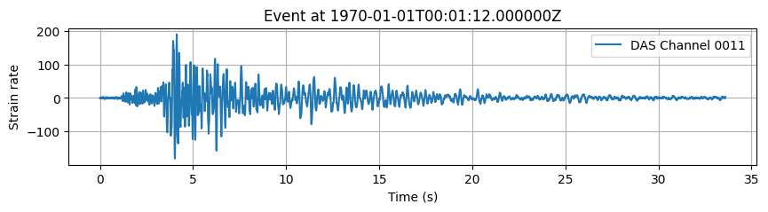

# RNN-DAS: A New Deep Learning Approach for Detection and Real-Time Monitoring of Volcano-Tectonic Events Using Distributed Acoustic Sensing

## Overview
RNN-DAS is an innovative Deep Learning model based on Recurrent Neural Networks (RNNs) with Long Short-Term Memory (LSTM) cells, developed for real-time Volcano-Seismic Signal Recognition (VSR) using Distributed Acoustic Sensing (DAS) measurements. The model was trained on a comprehensive dataset of Volcano-Tectonic (VT) events from the 2021 La Palma eruption, recorded by a High-fidelity submarine Distributed Acoustic Sensing array (HDAS) located near the eruption site.

RNN-DAS is capable of detecting VT events, analyzing their temporal evolution, and classifying their waveforms with approximately 97% accuracy. The model has demonstrated excellent generalization capabilities for different time intervals and volcanoes, facilitating continuous, real-time seismic monitoring with minimal computational resources and retraining requirements.

This software was developed as part of the DigiVolCan project - A digital infrastructure for forecasting volcanic eruptions in the Canary Islands.
The results from the RNN-DAS model are the outcome of collaboration between the University of Granada, the Canary Islands Volcanological Institute (INVOLCAN), the Institute of Technological and Renewable Energies (ITER), the University of La Laguna, and Aragón Photonics.


The project was funded by the Ministry of Science, Innovation, and Universities / State Research Agency (MICIU/AEI) of Spain, and the European Union through the Recovery, Transformation, and Resilience Plan, Next Generation EU Funds.
Project: PLEC2022-009271 funded by MICIU/AEI /10.13039/501100011033 and by the European Union Next GenerationEU/ PRTR.

## Features
- Detection and classification of volcano-seismic events from DAS data.
- Utilizes frequency-based signal energy features to enhance spatial and temporal contextual information.
- High accuracy in detecting and classifying complete waveforms.
- Real-time processing capabilities for continuous monitoring.
- Generalizable to different volcanic environments with minimal retraining.

## Installation and Requirements  

The model has been **trained and tested** for functionality in:

- **Python** 3.7  
- **GPU**: NVIDIA GeForce GTX 1080  
- **CUDA**: version 9.0  

The model should work without issues on these versions and later, both on **Windows** and **Linux**.  

### Windows Installation

To run RNN-DAS on **Windows**, you can install the required dependencies using the provided `requirements_windows.txt` file from the `requirements` folder in the GitHub repository:  

```bash
pip install -r requirements/requirements_windows.txt
```  

Alternatively, you can create the Conda environment `RNN_DAS` using the provided `RNN_DAS_windows.yml` file from the `requirements` folder:  

```bash
conda env create -f requirements/RNN_DAS_windows.yml
conda activate RNN_DAS
```

### Linux Installation

To run RNN-DAS on **Linux**, you can install the required dependencies using the provided `requirements_linux.txt` file from the `requirements` folder in the GitHub repository:  

```bash
pip install -r requirements/requirements_linux.txt
```  

Alternatively, you can create the Conda environment `RNN_DAS` using the provided `RNN_DAS_linux.yml` file from the `requirements` folder:  

```bash
conda env create -f requirements/RNN_DAS_linux.yml
conda activate RNN_DAS
```


## Running the Model

The model is designed to process data from text files listing event IDs, which correspond to the HDF5 files containing the DAS data. The expected structure of the HDF5 files is:

```
file_path
│
└───"data" (dataset)
    │
    ├───data (2D matrix of strain or strain rate)
    │    └───[channels x time_samples] 
    │
    ├───attrs
         │
         ├───"dt_s" (temporal sampling in seconds)
         ├───"dx_m" (spatial sampling in meters)
         └───"begin_time" (start date in '1970-01-01T00:00:00.000' format)
```

- `data`: A 2D matrix of strain or strain rate, with dimensions channels x time_samples of DAS data.
- `dt_s`: The temporal sampling in seconds (s).
- `dx_m`: The spatial sampling in meters (m) between channels.
- `begin_time`: The start date in the format `'1970-01-01T00:00:00.000'`.

To run the model, you must provide a `files_id.txt` file, which lists the event IDs corresponding to the HDF5 files to be processed. This file should contain one event ID per line:

```
event_id_1
event_id_2
event_id_3
...
```

### Command-Line Execution

To execute the model, use the following command:

```bash
python RNN_DAS.py --files_id files_id.txt
```

Where `files_id.txt` is the required text file containing the list of event IDs. By default, the data `.h5` files should be located in the `data_to_predict` folder.

To customize additional parameters, use:

```bash
python RNN_DAS.py --help
```

Maintaining the folder structure provided in the repository is recommended to ensure proper functionality, although it is possible to modify it by changing the argparse parameters.

#### Saving Results

By default, the model uses the probability results with the applied grammar function. These probabilities and predictions can also be stored in the `RNN-DAS_predictions` folder in `.pkl` format if configured to do so.

Using these probability results, the model generates outputs in both CSV and MiniSEED (MSEED) formats. The CSV files are stored in the `RNN-DAS_picks` folder, named according to the corresponding event_id. The MiniSEED files are saved in the `RNN-DAS_waveforms` folder, also named with the event_id. Additionally, different plotting options are stored in the `plots` folder. By default, the `bi` option is enabled, allowing users to visualize both the model’s prediction and the original data.

##### CSV Output
The CSV file contains event detections with the following structure:

| channel_index | event_index | event_time           | event_score | coda_index | coda_time             | windows                      |
|--------------|------------|----------------------|-------------|-----------|-----------------------|------------------------------|
| 0            | 7200       | 1970-01-01T00:01:12  | 1.000       | 9120      | 1970-01-01T00:01:31.2 | [15, 16, 17, 18]            |
| 0            | 10080      | 1970-01-01T00:01:40  | 0.741       | 10560     | 1970-01-01T00:01:45.6 | [21]                         |
| 1            | 7200       | 1970-01-01T00:01:12  | 0.938       | 10560     | 1970-01-01T00:01:45.6 | [15, 16, 17, 18, 19, 20, 21] |
| ...          | ...        | ...                  | ...         | ...       | ...                   | ...                          |


- `channel_index`: DAS channel where an event was detected.
- `event_index`: Sample index where the event starts.
- `event_time`: Timestamp of event start.
- `event_score`: Probability or confidence measure associated with the detection.
- `coda_index`: Sample index where the event ends.
- `coda_time`: Timestamp of event end.
- `windows`: Temporal windows selected by the model as events.

##### MiniSEED (MSEED) Output
The MiniSEED files store detected event waveforms. Each trace corresponds to a detected event with a probability threshold (default: 0.9). Example:

```
LP.DAS_0.XX.0000 | 1970-01-01T00:01:12.000000Z - 1970-01-01T00:01:31.190000Z | 100.0 Hz, 1920 samples
...
(76 other traces)
...
LP.DAS_96.XX.0096 | 1970-01-01T00:01:12.000000Z - 1970-01-01T00:01:50.390000Z | 100.0 Hz, 3840 samples
```

Each trace includes:
- The corresponding DAS channel.
- The time interval containing the waveform of the detected event.
- The sampling rate and number of samples.

Example:


### Example Notebook: Running RNN-DAS on La Palma Data

An example Jupyter Notebook is provided to demonstrate how the model operates on real data from the 2021 La Palma eruption. This notebook walks through loading the DAS dataset, preprocessing signals, and running the trained model on a sample 3-minute VT event with a magnitude of Ml=4.04. The provided test data corresponds only to the first 100 channels of the DAS array due to repository size limitations. 
To explore the example, open the notebook:

```bash
jupyter notebook examples/RNN-DAS_LaPalma.ipynb
```

To apply the model to the full dataset in the Jupyter Notebook, download the data from:

[Google Drive Link](https://drive.google.com/drive/folders/14WtA6HrQX0GVHJKBOkrGRWHS6EuOw1uo?usp=sharing)

and use it within the notebook.


## Citation
If you use this model or any part of this repository, please cite the corresponding article:

> [RNN-DAS: A New Deep Learning Approach for Detection and Real-Time Monitoring of Volcano-Tectonic Events Using Distributed Acoustic Sensing](URL_to_the_article)

## License
This repository and its contents are subject to the same terms and conditions as specified in the accompanying publication. Future updates may refine the model or add new functionalities.

For inquiries or contributions, feel free to open an issue or submit a pull request.

