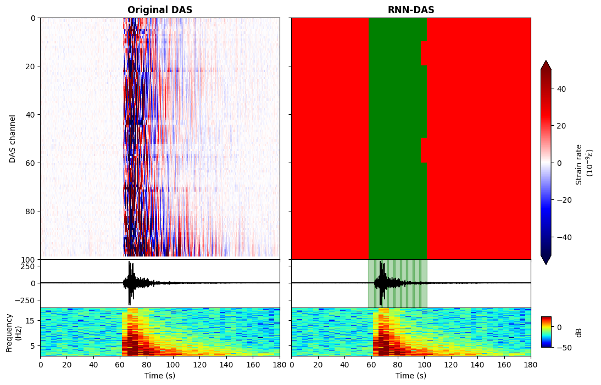
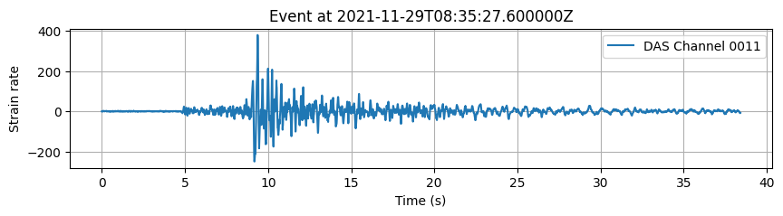
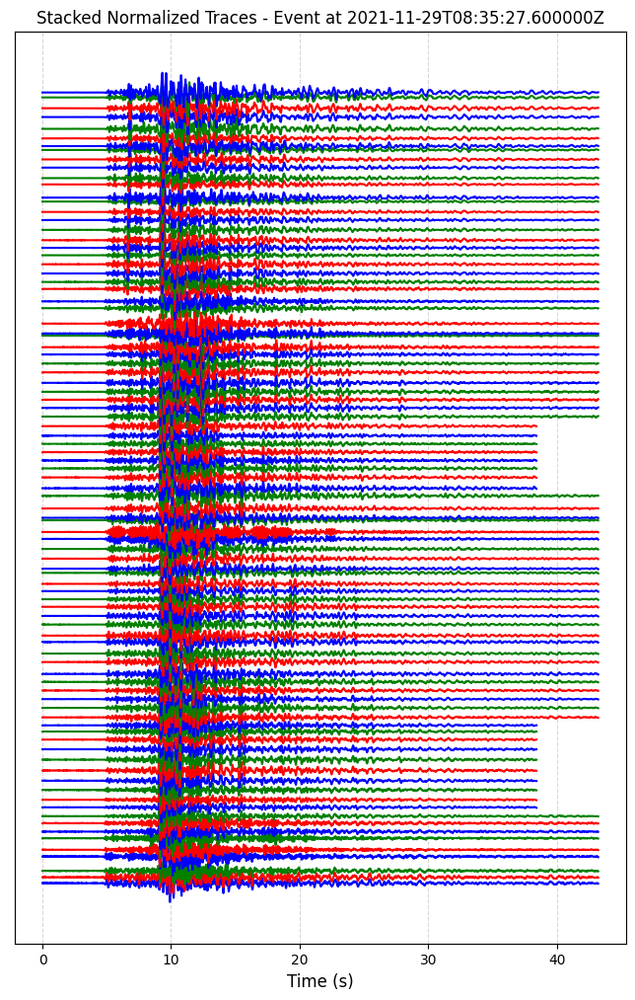

# RNN-DAS: A New Deep Learning Approach for Detection and Real-Time Monitoring of Volcano-Tectonic Events Using Distributed Acoustic Sensing

## Overview
RNN-DAS is an innovative Deep Learning model based on Recurrent Neural Networks (RNNs) with Long Short-Term Memory (LSTM) cells, developed for real-time Volcano-seismic Signal Recognition (VSR) using Distributed Acoustic Sensing (DAS) measurements. The model was trained on a comprehensive dataset of Volcano-Tectonic (VT) events from the 2021 La Palma eruption, recorded by a High-fidelity submarine Distributed Acoustic Sensing array (HDAS) located near the eruption site.

RNN-DAS can detect VT events, track their temporal evolution, and classify their waveforms with approximately 97% accuracy when tested on a database of over 2 million unique strain waveforms, enabling real-time continuous data predictions. The model has demonstrated excellent generalization capabilities for different time intervals and volcanoes, facilitating continuous, real-time seismic monitoring with minimal computational resources and retraining requirements.

## Features
- Detection and classification of volcano-seismic events from DAS data.
- Utilizes frequency-based signal energy features to enhance spatial and temporal contextual information.
- High accuracy in detecting and classifying complete waveforms.
- Real-time processing capabilities for continuous monitoring.
- Generalizable to different volcanic environments with minimal retraining.

## Installation and Requirements  

The model has been **trained and tested** for functionality in:

- **Python** 3.7  
- **GPU**: NVIDIA GeForce GTX 1080  
- **CUDA**: version 9.0  

The model should work without issues on these versions and later, both on **Windows** and **Linux**.  

### Windows Installation

To run RNN-DAS on **Windows**, you can install the required dependencies using the provided `requirements_windows.txt` file from the `requirements` folder in the GitHub repository:  

```bash
pip install -r requirements/requirements_windows.txt
```  

Alternatively, you can create the Conda environment `RNN_DAS` using the provided `RNN_DAS_windows.yml` file from the `requirements` folder:  

```bash
conda env create -f requirements/RNN_DAS_windows.yml
conda activate RNN_DAS
```

### Linux Installation

To run RNN-DAS on **Linux**, you can install the required dependencies using the provided `requirements_linux.txt` file from the `requirements` folder in the GitHub repository:  

```bash
pip install -r requirements/requirements_linux.txt
```  

Alternatively, you can create the Conda environment `RNN_DAS` using the provided `RNN_DAS_linux.yml` file from the `requirements` folder:  

```bash
conda env create -f requirements/RNN_DAS_linux.yml
conda activate RNN_DAS
```


## Running the Model

The model is designed to process data from text files listing event IDs, which correspond to the HDF5 files containing the DAS data. The expected structure of the HDF5 files is:

```
file_path
│
└───"data" (dataset)
    │
    ├───data (2D matrix of strain or strain rate)
    │    └───[channels x time_samples] 
    │
    ├───attrs
         │
         ├───"dt_s" (temporal sampling in seconds)
         ├───"dx_m" (spatial sampling in meters)
         └───"begin_time" (start date in '1970-01-01T00:00:00.000' format)
```

- `data`: A 2D matrix of strain or strain rate, with dimensions channels x time_samples of DAS data.
- `dt_s`: The temporal sampling in seconds (s).
- `dx_m`: The spatial sampling in meters (m) between channels.
- `begin_time`: The start date in the format `'1970-01-01T00:00:00.000'`.

To run the model, you must provide a `files.txt` file, which lists the event IDs corresponding to the HDF5 files to be processed. This file should contain one event ID per line:

```
event_id_1
event_id_2
event_id_3
...
```

### Command-Line Execution

To execute the model, use the following command:

```bash
python RNN-DAS.py --files_id files.txt
```

Where `files.txt` is the required text file containing the list of event IDs. By default, the data `.h5` files should be located in the `data_to_predict` folder.

The code is designed to implement parallelization to accelerate the computation of signal features. This configuration can be adjusted based on the available hardware. By default, the process utilizes one-third of the total CPU cores, but this parameter should be modified with caution to prevent system overload. Increasing the number of cores reduces computation time.  

To customize additional parameters, use:

```bash
python RNN-DAS.py --help
usage: RNN-DAS.py [-h] [--model_path MODEL_PATH]
                  [--normalization_path NORMALIZATION_PATH]
                  [--files_id FILES_ID] [--data_folder DATA_FOLDER]
                  [--pre_processing PRE_PROCESSING] [--dt DT] [--dx DX]
                  [--n_cpu N_CPU]
                  [--plot_das PLOT_DAS] [--plot_das_bi PLOT_DAS_BI]
                  [--plot_das_grammar PLOT_DAS_GRAMMAR]
                  [--plot_stream_stack PLOT_STREAM_STACK]
                  [--plot_threshold PLOT_THRESHOLD]
                  [--plot_channel PLOT_CHANNEL] [--grammar GRAMMAR]
                  [--predictions_saved PREDICTIONS_SAVED]
                  [--probabilities_saved PROBABILITIES_SAVED]
                  [--save_results_csv SAVE_RESULTS_CSV]
                  [--save_results_mseed SAVE_RESULTS_MSEED]
                  [--grammar_save GRAMMAR_SAVE]
                  [--grammar_parameters_threshold GRAMMAR_PARAMETERS_THRESHOLD]
                  [--grammar_parameter_threshold_channels GRAMMAR_PARAMETER_THRESHOLD_CHANNELS]
                  [--grammar_parameter_interval_size GRAMMAR_PARAMETER_INTERVAL_SIZE]
                  [--grammar_parameter_trigger_on GRAMMAR_PARAMETER_TRIGGER_ON]
                  [--grammar_parameter_trigger_off GRAMMAR_PARAMETER_TRIGGER_OFF]
                  [--threshold_mseed THRESHOLD_MSEED]
                  [--network_code NETWORK_CODE]
                  [--station_prefix STATION_PREFIX]
                  [--location_code LOCATION_CODE]

Run the RNN-DAS model with specified configurations.

optional arguments:
  -h, --help                                   Show this help message and exit
  --model_path MODEL_PATH                       Path to the trained RNN-DAS model (default: './model/RNN-DAS_1150').
  --normalization_path NORMALIZATION_PATH       Path to the normalization file (default: './model/Normalization_RNN-DAS_1150.txt').
  --files_id FILES_ID                           Path to the text file containing the list of file IDs (default: './files.txt').
  --data_folder DATA_FOLDER                     Path to the data files folder (default: './data_to_predict').
  --pre_processing PRE_PROCESSING               Apply pre-processing to the data before running the model (default: True).
  --dt DT                                       Sampling time in seconds (default: 0.01).
  --dx DX                                       Sampling spacing in meters (default: 10).
  --n_cpu N_CPU                                 Number of cpu cores to be used for parallelization, modify this parameter with caution (default: os.cpu_count()/3)
  --plot_das PLOT_DAS                           Plot DAS data before running the model (default: False).
  --plot_das_bi PLOT_DAS_BI                     Plot DAS data with the grammar-based predictions (default: True).
  --plot_das_grammar PLOT_DAS_GRAMMAR           Plot grammar-based vs raw DAS predictions (default: False).
  --plot_stream_stack PLOT_STREAM_STACK         Plot stacked stream traces (default: False).
  --plot_threshold PLOT_THRESHOLD               Threshold for predominant probability class per frame (default: 2/3).
  --plot_channel PLOT_CHANNEL                   DAS channel to plot (default: 50).
  --grammar GRAMMAR                             Enable grammar-based event detection (default: True).
  --predictions_saved PREDICTIONS_SAVED         Save model predictions (default: False).
  --probabilities_saved PROBABILITIES_SAVED     Save prediction probabilities (default: False).
  --save_results_csv SAVE_RESULTS_CSV           Save results in CSV format (default: True).
  --save_results_mseed SAVE_RESULTS_MSEED       Save waveform results in MiniSEED format (default: True).
  --grammar_save GRAMMAR_SAVE                   Save grammar results (default: True).
  --grammar_parameters_threshold
    GRAMMAR_PARAMETERS_THRESHOLD                Threshold for grammar-based event detection (default: 2/3).
  --grammar_parameter_threshold_channels
    GRAMMAR_PARAMETER_THRESHOLD_CHANNELS        Channel-based grammar threshold (default: 0.5).
  --grammar_parameter_interval_size
    GRAMMAR_PARAMETER_INTERVAL_SIZE             Interval size for grammar-based analysis (default: 10).
  --grammar_parameter_trigger_on
    GRAMMAR_PARAMETER_TRIGGER_ON                Trigger-on threshold for grammar-based detection (default: 0.9).
  --grammar_parameter_trigger_off
    GRAMMAR_PARAMETER_TRIGGER_OFF               Trigger-off threshold for grammar-based detection (default: 0.05).
  --threshold_mseed THRESHOLD_MSEED             Threshold for trace detection (default: 0.9).
  --network_code NETWORK_CODE                   Network code (default: 'LP').
  --station_prefix STATION_PREFIX               Station prefix (default: 'DAS').
  --location_code LOCATION_CODE                 Location code (default: 'XX').


```

Maintaining the folder structure provided in the repository is recommended to ensure proper functionality, although it is possible to modify it by changing the argparse parameters.

#### Saving Results

By default, the model uses the probability results with the applied grammar function. These probabilities and predictions can also be stored in the `RNN-DAS_predictions` folder in `.pkl` format if configured to do so.

Using these probability results, the model generates outputs in both CSV and MiniSEED (MSEED) formats. The CSV files are stored in the `RNN-DAS_picks` folder, named according to the corresponding event_id. The MiniSEED files are saved in the `RNN-DAS_waveforms` folder, also named with the event_id. Additionally, different plotting options are stored in the `plots` folder. By default, the `bi` option is enabled, allowing users to visualize both the model’s prediction and the original data.



##### CSV Output
The CSV file contains event detections with the following structure:

| channel_index | event_index | event_time           | event_score | coda_index | coda_time             | windows                      |
|--------------|------------|----------------------|-------------|-----------|-----------------------|------------------------------|
| 0            | 7200       | 1970-01-01T00:01:12  | 1.000       | 9120      | 1970-01-01T00:01:31.2 | [15, 16, 17, 18]            |
| 0            | 10080      | 1970-01-01T00:01:40  | 0.741       | 10560     | 1970-01-01T00:01:45.6 | [21]                         |
| 1            | 7200       | 1970-01-01T00:01:12  | 0.938       | 10560     | 1970-01-01T00:01:45.6 | [15, 16, 17, 18, 19, 20, 21] |
| ...          | ...        | ...                  | ...         | ...       | ...                   | ...                          |


- `channel_index`: DAS channel where an event was detected.
- `event_index`: Sample index where the event starts.
- `event_time`: Timestamp of event start.
- `event_score`: Probability or confidence measure associated with the detection.
- `coda_index`: Sample index where the event ends.
- `coda_time`: Timestamp of event end.
- `windows`: Temporal windows selected by the model as events.

##### MiniSEED (MSEED) Output
The MiniSEED files store detected event waveforms. Each trace corresponds to a detected event with a probability threshold (default: 0.9). Example:

```
LP.DAS_0.XX.0000 | 1970-01-01T00:01:12.000000Z - 1970-01-01T00:01:31.190000Z | 100.0 Hz, 1920 samples
...
(76 other traces)
...
LP.DAS_96.XX.0096 | 1970-01-01T00:01:12.000000Z - 1970-01-01T00:01:50.390000Z | 100.0 Hz, 3840 samples
```

Each trace includes:
- The corresponding DAS channel.
- The time interval containing the waveform of the detected event.
- The sampling rate and number of samples.

For instance, for a single DAS channel, the waveform of an event detected by RNN-DAS appears as follows:


While all the detected traces for this event are shown as follows:



### Example Notebook: Running RNN-DAS on La Palma Data

An example Jupyter Notebook is provided to demonstrate how the model operates on real data from the 2021 La Palma eruption. This notebook walks through loading the DAS dataset, preprocessing signals, and running the trained model on a sample 3-minute VT event with a magnitude of Ml=4.22. The provided test data corresponds only to the first 100 channels of the DAS array due to repository size limitations. 
To explore the example, open the notebook:

```bash
jupyter notebook examples/RNN-DAS_LaPalma.ipynb
```

To test the model on more DAS data, several datasets are available in the dedicated Zenodo repository (https://doi.org/10.5281/zenodo.15105596). You can:

-> Use them directly within the provided Jupyter Notebook (see the example notebook), or

-> Run the model from the command line using the execution script.

Download the desired dataset and follow the instructions in the notebook or execute the model via the terminal.

## Retraining

To carry out the retraining of the model and better adapt it to the characteristics of volcanic seismicity from a different volcanic environment, it is encouraged to contact the corresponding author for guidance and support. 

You can reach the corresponding author (Javier Fernández-Carabantes) at: **javierfyc@ugr.es**  
**Institution:** 
Departamento de Física Teórica y del Cosmos, Universidad de Granada, Granada, Spain


## Citation
If you use the model, please cite both the preprint and the dataset:

Preprint:
Fernandez-Carabantes, J., Titos, M., D'Auria, L., Garcia, J., Garcia, L., & Benitez, C. (2025). RNN-DAS: A New Deep Learning Approach for Detection and Real-Time Monitoring of Volcano-Tectonic Events Using Distributed Acoustic Sensing. arXiv preprint arXiv:2503.11622.

Dataset:
Fernández Carabantes, J. J., Titos, M., D'Auria, L., García, J., García, L., & Benítez, C. (2025). RNN-DAS: A New Deep Learning Approach for Detection and Real-Time Monitoring of Volcano-Tectonic Events Using Distributed Acoustic Sensing [Data set]. Zenodo. https://doi.org/10.5281/zenodo.15105596


## License
This repository and its contents are subject to the same terms and conditions as specified in the accompanying publication. Future updates may refine the model or add new functionalities.

For inquiries or contributions, feel free to open an issue or submit a pull request.

## Acknowledgments

This software was developed as part of the DigiVolCan project - A digital infrastructure for forecasting volcanic eruptions in the Canary Islands.
The results from the RNN-DAS model are the outcome of collaboration between the University of Granada, the Canary Islands Volcanological Institute (INVOLCAN), the Institute of Technological and Renewable Energies (ITER), the University of La Laguna, and Aragón Photonics.


The project was funded by the Ministry of Science, Innovation, and Universities / State Research Agency (MICIU/AEI) of Spain, and the European Union through the Recovery, Transformation, and Resilience Plan, Next Generation EU Funds.
Project: PLEC2022-009271 funded by MICIU/AEI /10.13039/501100011033 and by the European Union Next GenerationEU/ PRTR.

